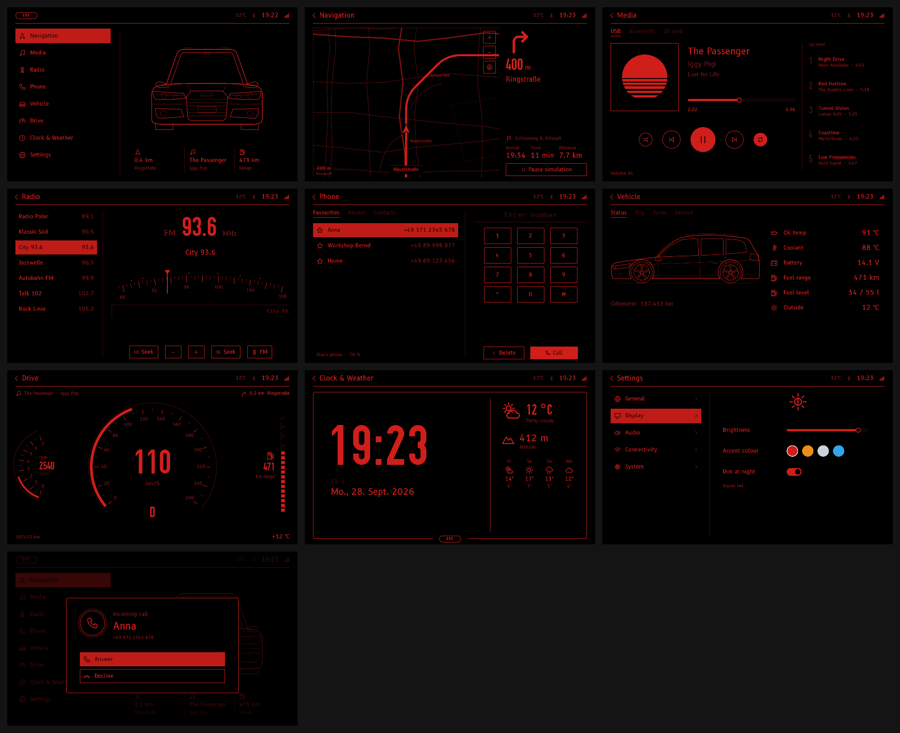

# R80 Headunit – UI mockup

Clickable look-and-feel mockup of the new headunit for the Audi A3 Sportback (8PA, 2005) project.
Everything runs on Linux with open-source parts only; all data is simulated.



## Run it

Needs Python 3.9+ and Qt 6 via PySide6 (LGPL):

```bash
cd hu-mockup
python3 -m pip install PySide6        # once
python3 run.py                        # window, 1280 x 768
python3 run.py --fullscreen
python3 run.py --screenshots screenshots/   # render every screen to PNG and quit
```

The QML is plain Qt 6 (6.5 or newer), so it also runs with the distro's Qt tools
without Python, e.g. on Debian/Ubuntu:

```bash
sudo apt install qml6 qml6-module-qtquick qml6-module-qtquick-shapes qml6-module-qtquick-window qml6-module-qtqml-workerscript
qml6 qml/main.qml        # the binary may be called `qml` on other distros
```

## Controls (MMI-style)

| Input | Action |
|---|---|
| Mouse / touch | tap anything |
| Mouse wheel, ↑ / ↓ | turn the control knob |
| ← / → | push the knob sideways (tune, tabs, sliders) |
| Enter / Space | press the knob |
| Esc / Backspace / H | back to home |
| 1 – 8 | jump to Navigation, Media, Radio, Phone, Vehicle, Drive, Clock, Settings |
| C | simulate an incoming call |
| F11 | toggle fullscreen |

## Screens

Home, Navigation (moving map with simulated route guidance), Media, Radio (FM dial),
Phone (favourites/recent/contacts, keypad, call popup), Vehicle (status, trip, tyres,
service), Drive (virtual cluster), Clock & Weather, Settings. Under
Settings → Display you can change brightness and the accent colour (red, amber,
white, ice blue) live.

## Layout of the code

```
run.py                 launcher + screenshot mode
qml/main.qml           window, header, screen switching, knob/key handling
qml/Theme.qml          colours, fonts, sizes (single place to restyle)
qml/Sim.qml            fake vehicle / media / radio / phone / nav data
qml/Icons.qml          ~60 self-drawn line icons as SVG path data (24x24)
qml/*Screen.qml        one file per screen
qml/CarFront.qml, CarSide.qml   self-drawn car line art
fonts/                 B612 (OFL/EPL) and OSP-DIN (OFL) with licence files
docs/UI_vision_V01.png the visual direction this mockup follows
docs/car_blueprint_reference.png  A3 8PA blueprint (AI-generated by Alex) used for the car drawings
```

## Notes

- Design resolution is 1280 x 768 (5:3, the proportions of the vision sheet); the
  window scales to any size.
- The brand mark is a placeholder ("R80"), because the four rings are an Audi
  trademark. Swap `qml/Logo.qml` if you want something else.
- No third-party icon sets or images: icons, car drawings, map and cover art are
  drawn in code.
